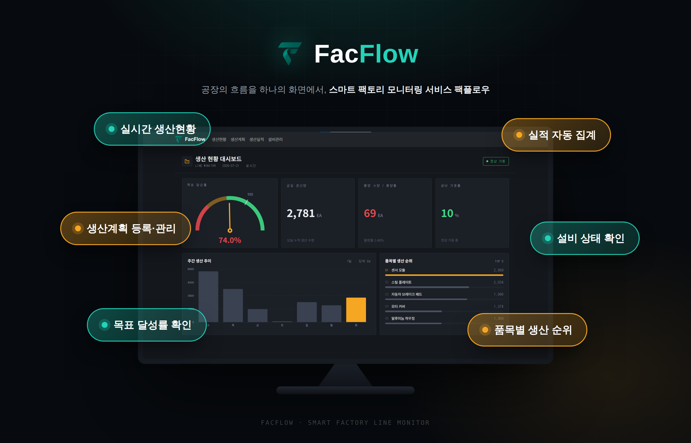
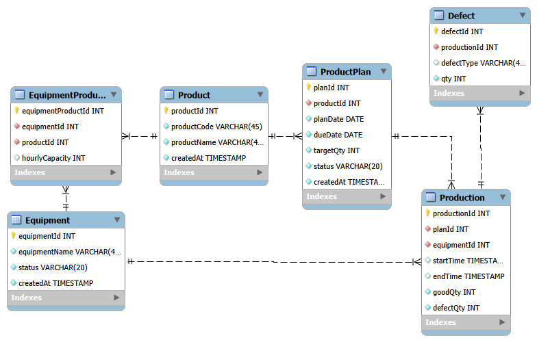
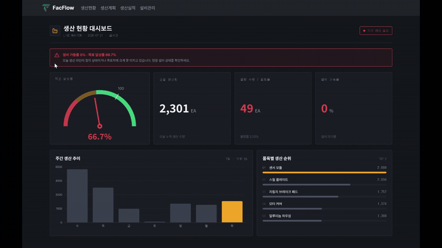
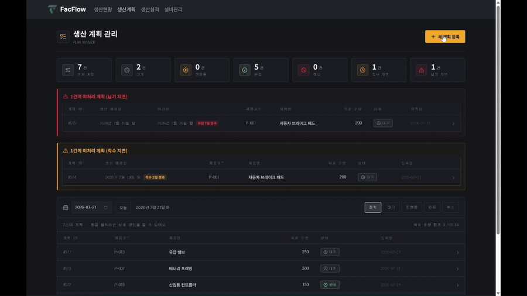
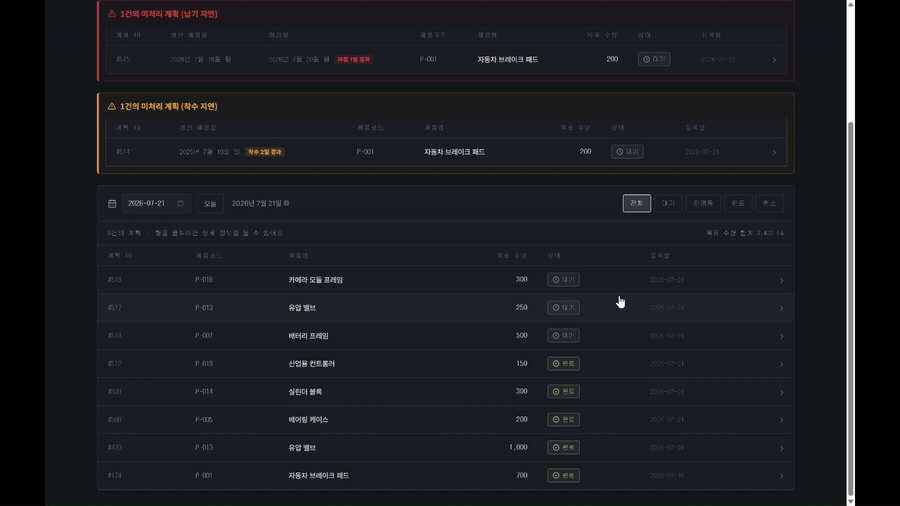
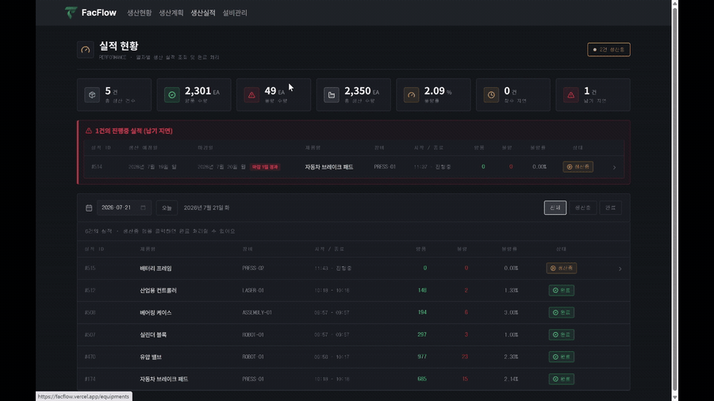
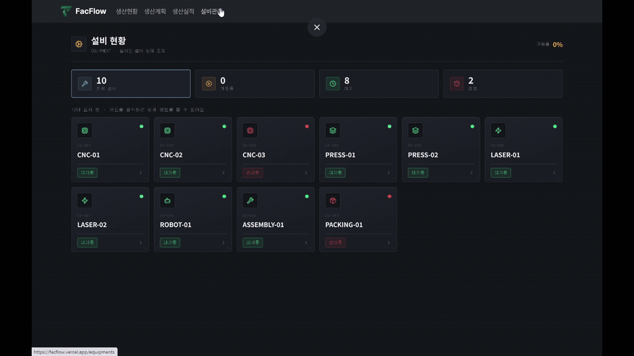

# 🏭 FacFlow


> 생산 계획부터 생산 실적, 설비, 품질 데이터까지 통합 관리할 수 있는 웹 기반 MES(Manufacturing Execution System)


## 🔗 배포

**[FacFlow Live Demo](https://facflow.vercel.app/)** · Frontend (Vercel) · Backend API (AWS EC2)

---

## 📌 프로젝트 소개


FacFlow는 제조업의 생산 과정을 관리하는 웹 기반 MES 시스템입니다.


생산 계획을 등록하고 설비를 배정해 생산을 시작·종료할 수 있으며, 생산 가능 설비와 시간당 생산량을 기준으로 **예상 소요 시간이 가장 짧은 설비**를 추천합니다.

생산 종료 시 양품·불량 수량이 함께 기록되고, **착수/납기 지연**과 **생산 중단(HALT)** 계획을 확인할 수 있습니다. 대시보드에서는 생산량, 불량률, 설비 가동 현황 등 핵심 지표를 한눈에 볼 수 있습니다.

**단순 CRUD를 넘어 생산 계획 → 착수 → 실적 기록(양품/불량) → 완료로 이어지는 MES 업무 흐름과, 설비·계획 상태 연동을 목표로 개발했습니다.**

---

## ✨ 주요 기능

- 📊 **생산 현황 대시보드** — 생산량, 달성률, 불량률, 설비 가동률과 주간 생산 추이·품목별 순위를 한눈에 확인
- 📅 **생산 계획 관리** — 계획 생성·조회·취소, 착수/납기 **지연** 및 **HALT** 계획 알림, 중단 계획 재시작
- 🤖 **설비 추천** — 생산 가능 `IDLE` 설비 중 **예상 소요 시간이 가장 짧은 설비**와 완료 예상 시간 제공
- 🏭 **생산 실적 관리** — 생산 시작·종료 시 양품·불량 수량 기록, 잔량·불량률·생산 이력 조회
- ⚙️ **설비 관리** — 설비 상태(`IDLE` / `RUN` / `STOP`) 확인 및 생산 가능 품목·시간당 생산량 조회
- 📈 **품질 데이터 추적** — 생산 종료 시 기록된 불량 수량을 실적·대시보드·설비 통계에서 집계·확인

---

## 🛠 기술 스택

| 분야 | 기술 |
|------|------|
| **Language** | JavaScript |
| **Frontend** | React, Vite, React Router, Axios, Recharts, Lucide React |
| **Backend** | Node.js, Express, Winston |
| **Database** | MySQL |
| **Deployment** | Vercel, AWS EC2, PM2 |
| **Version Control** | Git, GitHub |

---

## 📊 ERD



---

## 📷 화면

### 📈 Dashboard




### 📅 생산 계획






### 🏭 생산 관리




### ⚙️ 설비 관리



---

## 💡 기술적 구현

### 🤖 설비 추천 로직

`EquipmentProduct` 매핑으로 해당 품목을 생산할 수 있는 설비만 조회하고, `IDLE` 상태인 설비에 한해 `estimatedHours = targetQty / hourlyCapacity`를 계산합니다.

이 중 **예상 소요 시간이 가장 짧은 설비**를 `recommendation`으로 반환하고, 후보 설비 목록과 함께 UI에 표시해 착수 전 설비 선택에 활용할 수 있도록 했습니다.


### 📊 SQL 기반 데이터 집계

`JOIN`, `SUM`, `COUNT`, `CASE WHEN`, `NULLIF`, `GREATEST` 등을 활용해 대시보드 KPI·계획·실적 데이터를 DB에서 한 번에 조회하도록 구현했습니다.

예를 들어 계획 목록에서는 `Production`과 조인해 **잔량(remainingQty)** 을 계산하고, `planDate`·`dueDate`와 상태를 기준으로 **착수/납기 지연 계획**과 **HALT 계획**을 분리 조회합니다. 대시보드에서는 달성률·불량률·설비 가동률·주간 생산 추이를 SQL 집계로 처리합니다.


### 🗄️ 관계형 데이터 모델링

`Product`, `ProductPlan`, `Production`, `Equipment`, `Defect`를 분리하고 외래 키로 연결해 생산 흐름의 일관성을 유지했습니다.

`EquipmentProduct`로 설비와 제품의 **N:M 관계**와 `hourlyCapacity`를 관리합니다. `Defect` 테이블은 `Production`과 연결하는 **스키마 설계**로 두었고, 현재 앱에서는 `Production.defectQty`를 중심으로 불량을 집계합니다. 계획 착수·종료·HALT 재시작 시에는 **트랜잭션**으로 계획 상태, 설비 상태, 생산 실적을 함께 갱신합니다.

---

## 📡 API

| Method | URL | Description |
|--------|-----|-------------|
| GET | /dashboard | 대시보드 조회 |
| GET | /plan | 생산 계획 조회 (`planDate`) |
| POST | /plan | 생산 계획 등록 |
| PATCH | /plan/:planId | 계획 상태 변경 (`status`) |
| PATCH | /plan/:planId/start | 생산 시작 (`equipmentId`) |
| POST | /plan/:planId/resume | 중단 계획 재시작 (`equipmentId`) |
| GET | /plan/:planId/available-equipment | 시작 가능 설비 · 추천 조회 |
| GET | /production | 생산 실적 조회 (`planDate`) |
| PATCH | /production/:productionId/end | 생산 종료 |
| GET | /equipment | 설비 목록 조회 |
| GET | /idle-equipment | 대기 설비 조회 (`productId`) |
| PATCH | /equipment/:equipmentId/status | 설비 상태 변경 (`status`) |
| GET | /equipment/:equipmentId/detail | 설비 상세·생산 실적 조회 |
| GET | /product | 제품 목록 조회 |

---

## 📂 프로젝트 구조

<details>
<summary>📂 프로젝트 구조 보기</summary>

```text
facflow/
├── Readme.md
├── docs/
│   └── assets/
│       └── readme/                  # README용 ERD·화면 GIF
├── database/
│   ├── facflowSql.sql
│   └── mes_dummy_data.sql
├── backend/
│   └── facflow/
│       ├── index.js                 # 서버 진입점
│       ├── config/                  # DB, Express, JWT, Winston 설정
│       ├── log/                     # Winston 로그
│       └── src/
│           ├── controllers/         # dashboard, plan, production, equipment, product
│           ├── dao/                 # SQL 쿼리
│           ├── routes/              # API 라우트
│           ├── services/            # 비즈니스 로직
│           └── utils/               # date, productionQtyGenerator
└── frontend/
    └── facflow/
        ├── public/
        └── src/
            ├── api/                 # API 호출
            ├── pages/               # Dashboard, Plans, Productions, Equipments
            ├── components/          # common, dashboard, plans, productions, equipments
            ├── constants/
            ├── styles/
            └── utils/
```

</details>

---

## 🚀 빠른 시작

### 📋 사전 요구사항

- Node.js 20.19 이상 (또는 22.12 이상)
- MySQL

### 📦 설치 방법

#### 1. 저장소 클론

```bash
git clone https://github.com/anda201/facflow.git
cd facflow
```

#### 2. 의존성 설치

```bash
# Backend
cd backend/facflow
npm install

# Frontend
cd ../../frontend/facflow
npm install
```

#### 3. 환경 변수 설정

```bash
# Backend — backend/facflow 디렉터리에서
cp config/secret.example.js config/secret.js

# Frontend — frontend/facflow 디렉터리에서
cp .env.example .env
```

`backend/facflow/config/secret.js`에 DB·JWT 값을 설정하고, `frontend/facflow/.env`의 `VITE_API_URL`을 백엔드 주소에 맞게 수정합니다.

> Windows PowerShell: `Copy-Item config/secret.example.js config/secret.js` / `Copy-Item .env.example .env`

#### 4. 데이터베이스 설정

`database/facflowSql.sql`을 실행하여 `facflowDB` 스키마와 테이블을 생성한 뒤, `database/mes_dummy_data.sql`을 실행하여 더미 데이터를 넣습니다.

(`backend/facflow/config/secret.js`의 `database` 값도 `facflowDB`로 맞춰 주세요.)

#### 5. 개발 서버 실행

**Backend** (`backend/facflow`)

```bash
cd backend/facflow
npm start
```

> Windows PowerShell에서는 `npm run dev`(`NODE_ENV=development`)가 동작하지 않을 수 있습니다. 이 경우 `npm start`(nodemon)를 사용하세요.

**Frontend** (`frontend/facflow`)

```bash
cd frontend/facflow
npm run dev
```

#### 6. 실행

브라우저에서 프론트엔드 주소로 접속합니다.

```
http://localhost:5173
```

백엔드 API는 `http://localhost:3000` 에서 동작합니다.

---

## 📌 향후 개선 사항

- **API·폼 유효성 검사** — 필수값, 날짜·수량 범위, 상태 enum, 설비·계획 상태 전이 등 비즈니스 규칙을 백엔드에서 검증하고 프론트와 메시지를 맞춤
- **에러 응답 체계화** — 400/409 등 상황별 코드와 메시지를 구분해, 현재처럼 500으로만 뭉개지 않도록 개선
- **사용자 인증 및 권한 관리** — JWT 미들웨어를 API에 실제 적용하고 역할별 접근 제어
- **API·서비스 테스트** — 계획 생성·착수·중단(HALT) 등 핵심 흐름에 대한 단위·통합 테스트
- **계획 분산처리 스케줄링** — 설비 가용·생산능력·납기를 고려해 계획을 여러 설비·일정에 분산 배치하는 스케줄링 고도화
- **생산 이력 검색·필터링** — 날짜, 품목, 설비, 상태 기준 조회 기능 강화

---

## 👨‍💻 개발자

| 이름 | 담당 |
|------|------|
| 안다정 | Frontend · Backend · Database 설계 및 구현 |